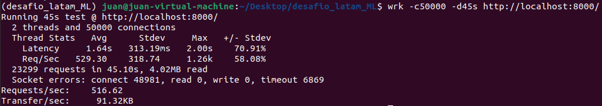

# Desafio LATAM

## General

Este desafío consiste en desplegar un modelo de ML que busca predecir la probabilidad de atraso de un vuelo con origen Santiago de Chile y múltiples destinos.
Para mayor información, ver detalles del desafío en el documento [Challenge](https://github.com/jdpinedaj/desafio_latam_ML/blob/master/document/Challenge%20-%20ML%20Engineer.pdf).

### Para correr la API:

#### Localmente

La API puede utilizarse de la siguiente manera:

`pip install pipenv`\
`pipenv install --system --deploy --ignore-pipfile`\
`pipenv shell`\
`cd TO/PATH`\
`uvicorn main:app --reload`

#### Usando Docker

Sin embargo, recomiendo usar docker como se m uestra a continuación:

cd a la carpeta de la app: `cd PATH/TO/desafio_latam_ML`
Corre docker: `docker-compose up --build -d`

#### Para encontrar soluciones

Recomendación: ve a tu buscador en http://localhost/docs (Asumiendo que tu docker se aloje alli, si no es asi, revisa que `docker ps` esté en el puerto 80).\
Después de esto, puedes testear la API directamente en el GUI: http://localhost/docs

### Archivos

`notebooks-implementation.ipynb` contiene el jupyter notebook donde los análisis al modelo entrregado por el data scientist son realizados.\
`main.py` contiene el codigo relacionado con la API.\
`test_main.py` contiene el test case para validar que el modelo esté funcionando correctamente.\
`Dockerfile` configura el servidor e instala las dependencias. Para este desafío he utilizado Uvicorn/FastApi.\
`docker-compose.yml` simplifica la ejecución para desplegar Docker.
`Pipfile` y `Pipfile.lock` son usados para manejar las dependencias del proyecto.\
`post.lua` y `testing_API.sh` permiten testear la API con el comando `wrk`.\
`.github/workflows` incluye la automatización de la construcción y exposición del modelo.

### Resultados de pruebas de estrés de la API

Para probar la API, se utilizó la herramienta [wrk](https://github.com/wg/wrk).\
Para correr la prueba, se utilizó el siguiente comando: `wrk -c50000 -d45s http://localhost:8000/`\, donde los resultados se pueden ver en la siguiente imagen:

Adicionalmente, se corrieron pruebas para ver el comportamiento de la API cuando se le pasan datos de entrada, según los mismos parámetros anteriores mediante la utilizacion del siguiente comando: `wrk -c50000 -d45s -s ./post.lua http://localhost:8000/predict` (utilizando el script presentado en el archivo `post.lua`), obteniendo los resultados presentados en la siguiente imagen:

### Consideraciones para mejorar el performance de la prueba anterior

Con el fin de incrementarr el requests/sec lo más posible, y mantener la Latencia lo más baja posible, se recomienda tener en cuenta las siguientes alternativas:

- Utilizar un modelo más simple, como un modelo de regresión logística (tal cual se entrenó, obteniendo buenos resultados, en el [Challenge anterior](https://github.com/jdpinedaj/desafio_latam/blob/master/notebooks/solution.ipynb)
- Escalar verticalmente, mediante la utilización de más recursos (CPU, RAM, etc).
- Escalar horizontalmente, mediante la utilización de más servidores.

### Github Actions

Se realiza automatización de la construcción y exposición del modelo utilizando GitHub Actions.
Se revisan posibles errores en el código corriendo los test cases, y luego se revisa que la API corra localmente.
El código se encuentra en `.github/workflows/main.yml`.
